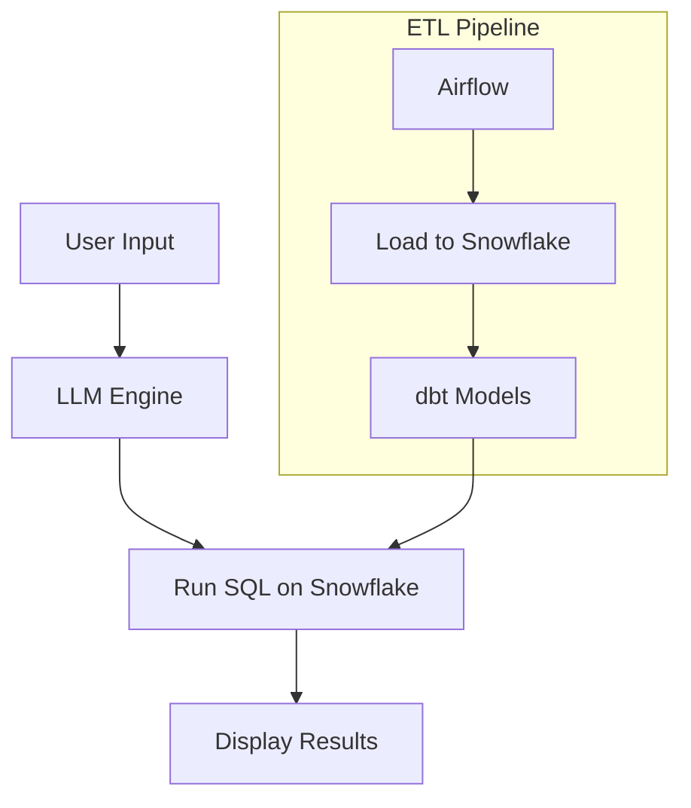

# 🧠 Smart Data Analyst: AI-Powered Natural Language Query System on Snowflake

Unlock the power of your data warehouse with **natural language queries**! This project enables business users to ask data questions in plain English and receive answers directly from **Snowflake**, powered by **OpenAI** and **LangChain**.

## 🚀 Overview

**Smart Data Analyst** is an end-to-end data analytics platform that empowers non-technical users to access and analyze data using simple natural language. The system automatically:

1. Converts user questions into optimized SQL queries.
2. Executes queries on Snowflake.
3. Displays the results as interactive tables or visualizations.

### 🌍 Real-World Use Case

> Business teams often rely on data analysts to extract insights using SQL. This tool eliminates that dependency by bridging the gap between humans and data using AI.

---

## 🧱 Tech Stack

### 💾 Data Stack
- **Airflow** – Schedules daily ingestion jobs from CSV/API
- **Snowflake** – Central cloud data warehouse
- **dbt** – Cleans and transforms raw data into analytical models
- **Airflow** – Orchestrates ETL workflows

### 🤖 AI & LLMs
- **OpenAI** – Converts natural language to SQL
- **LangChain** – Builds conversational logic and SQL agent
- **Prompt engineering** – Metadata-aware query generation

### 🎛️ Frontend
- **Streamlit** – UI for user interaction and visualization

---

## 🔧 System Architecture

---

## 🛠️ How It Works

1. **Data Ingestion**:
   - Uses Airflow to load daily data into Snowflake.
  
2. **Data Modeling**:
   - `dbt` models raw data into clean, analytics-friendly tables like `orders_summary`, `customer_lifetime_value`.

3. **Natural Language Query**:
   - User asks: _"What are the top 5 products by revenue this month?"_
   - LangChain + OpenAI translates to SQL.
   - SQL runs on Snowflake, returns results.
   - Streamlit renders results as a table or chart.

---

## 📦 Features

- 🗣️ **Ask in Natural Language** – No SQL knowledge required!
- 📊 **Data Visualization** – Auto-generates plots based on query type
- 🔄 **Automated ETL** – Daily refresh of real-world datasets
- 🧠 **Metadata-Aware SQL Generation** – Smarter prompts using table/column context

---

## 🧪 Example Queries

| Question | Output |
|---------|--------|
| _"Top 5 cities by total sales last year"_ | 📊 Bar chart |
| _"Average trip distance for yellow taxis in March"_ | 📈 Line chart |
| _"Customer count by region"_ | 📋 Table |

---

## 🧰 Future Enhancements

- 🧩 Add support for multi-turn conversations
- 🛡️ Implement role-based access control
- 🌐 Expand to multiple data sources (PostgreSQL, BigQuery)
- 📦 Deploy on cloud with CI/CD

---

## 📬 Contact

**Yash Chauhan**  
[LinkedIn](https://www.linkedin.com/in/yshchauhan) | y4shchauhan@gmail.com
